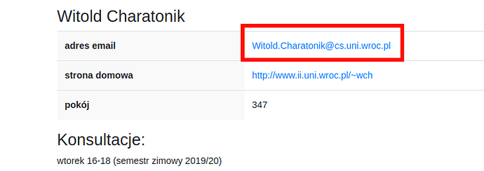

[Powrót](README.md)

# FAQ Studiowania

<b>Oryginalni twórcy</b>

> FAQ bazujące na wersji ze starego forum, bazującej na wersji z jeszcze starszego forum
> 
> Oryginalni autorzy FAQ:
> * [@Anna Karaś](https://github.com/annakaras)
> * [@Kamil Matuszewski](https://github.com/Arsenicro/)
> 
> Później rozwijane i utrzymywane przez:
> * [@Bartosz Bednarczyk](https://github.com/bartoszjanbednarczyk)
> * [@Dawid Dudek](https://github.com/DaDudek)

## Spis treści

* [Rekrutacja](#rekrutacja)
* [Dni adaptacyjne](#dni-adaptacyjne)
* [Budynek instytutu](#budynek-instytutu)
* [Studia vs szkoła](#studia-vs-szkoła)
* [Stypendium](#stypendium)
* [Kontakt z prowadzącymi](#kontakt-z-prowadzącymi)
* [Plan zajęć](#plan-zajęć)
* [Przedmioty](#przedmioty)
* [Praktyki zawodowe](#praktyki-zawodowe)
* [Praca dyplomowa](#praca-dyplomowa)
* [Projekt zespołowy](#projekt-zespołowy)
* [Praca zespołowa](#praca-zespołowa)
* [Zapisy](#zapisy)
* [Zajęcia](#zajęcia)
* [Sesja](#sesja)
* [Niepisane zasady panujące w II](#niepisane-zasady-panujące-w-ii)
* [Oprogramowanie i pracownie](#oprogramowanie-i-pracownie)

---

# Rekrutacja

Mam X punktów z matury, czy mam szansę się dostać?

> Możesz obliczyć liczbę punktów rekrutacyjnych przy użyciu [kalkulatora](https://ii.uni.wroc.pl/kalkulator) (Autor: [@iCarrot](https://github.com/iCarrrot), [repozytorium z kodem](https://github.com/iCarrrot/kalkulator-punktow)).

Czy bez matury z Y mam szansę dostać się na studia?

> W postępowaniu rekrutacyjnym brane będą pod uwagę wyniki egzaminów maturalnych z matematyki, informatyki, fizyki oraz dowolnego języka obcego nowożytnego. Więcej informacji znajdziesz na stronie [rekrutacji](https://rekrutacja.uni.wroc.pl/kierunek/informatyka-i-stopnia-stacjonarne-licencjackie-i-inzynierskie/#zasady).

# Dni adaptacyjne

Jest gdzieś szczegółowa rozpiska, jak te dni będą wyglądać?

> Plan dni adaptacyjnych jest dostępny [tutaj](https://ii.uni.wroc.pl/dla-studenta/dni-adaptacyjne)

Jak się ubrać na dni adaptacyjne?

> Ubiór galowy na immatrykulację nie jest wymagany, ale mile widziany. Na pozostałe dni należy ubrać się zwyczajnie (schludnie).

# Budynek instytutu

Czy w Instytucie Informatyki (dalej: II) obowiązuje jakiś dress code?

> Nie obowiązuje.

Czy będę mógł zostawić gdzieś swoją kurtkę/płaszcz?

> Każdy student może (wymagana kaucja zwrotna 20 zł) korzystać z szafki i zostawić tam swoje rzeczy. Szafki są dwuosobowe. W celu uzyskania dostępu do szafki, należy zgłosić się do pokoju 127 na I piętrze we wtorki 9:30-11:30 lub czwartki 9:30-11:30 i wziąć ze sobą kartę zobowiązań.

Jak można zdobyć pilot do parkingu II?

> Po pilot do szlabanu należy zgłosić się z kartą zobowiązań w to samo miejsce, co w przypadku szafki. Kaucja wynosi 100 zł.

Czy w II można coś zjeść?

> Na parterze znajduje się restauracja _Plastyczna_. Na pierwszym piętrze stoją automaty z napojami i przekąskami, które akceptują płatności kartą. Ponadto, w Instytucie Matematycznym również znajduje się bufet oraz kawiarnia _Budzik_.

Czy II jest przystosowany dla osób niepełnosprawnych?

> Na naszym kierunku studiowały osoby niepełnosprawne (m.in. niedosłyszące i poruszające się na wózkach inwalidzkich). W budynku jest winda.

# Studia vs szkoła

Jak się uczyć? Jak (z powodzeniem) skończyć studia?

> Przeczytaj [Porady odnośnie studiowania](porady_odnosnie_studiowania.md).

Czy sale są otwarte? Czy mogę "wypożyczyć" salę?

> Sale ćwiczeniowe bez telewizorów są otwarte, można do nich przyjść, gdy nie ma w nich zajęć, i na przykład wykorzystać je do grupowej lub indywidualnej nauki. Sale z telewizorami są zamknięte i drzwi otwiera dopiero prowadzący. Sale komputerowe oraz małe sale wykładowe też są zamknięte na klucz, ale ten klucz można "wypożyczyć" w portierni. W tym celu należy oddać swoją legitymację, wpisać godzinę pobrania klucza i podpisać się w zeszycie wypożyczeń. W salach można korzystać z komputerów, z rzutników, z tablic, oraz można podłączyć swojego laptopa (jest dużo gniazdek).

Czy w II obowiązuje obuwie zmienne?

> Nie obowiązuje.

Czy potrzebuję laptopa?

> Teoretycznie nie, ponieważ do każdych zajęć praktycznych jest udostępniona pracownia z odpowiednią liczbą stanowisk, a do sal można przychodzić też po zajęciach (do ok. godz. 22, też w weekendy). Natomiast mocno zalecam zakup laptopa z dobrą baterią lub noszenie zapasowej lub noszenie własnego rozgałęźnika - mamy naprawdę mało gniazdek na korytarzach.

Czy mogę siedzieć z laptopem na zajęciach?

> Zapewne zależy to od prowadzącego oraz od sposobu używania laptopa. Istotną sprawą jest korzystanie z laptopa w taki sposób, by prowadzący nie poczuł się przez to lekceważony. Jeżeli laptop ma służyć pisaniu notatek lub otworzeniu materiałów związanych z zajęciami (obecnie są to częste praktyki), to nie powinien on stanowić problemu, choć pewnie warto upewnić się o tym u prowadzącego. Jeżeli natomiast zamierzasz korzystać z laptopa w sposób niezwiązany z zajęciami, to raczej nie siedź wtedy w pierwszych ławkach (domyślnie zajmowanych przez najbardziej aktywną widownię, z którą prowadzący utrzymuje kontakt wzrokowy lub werbalny).

Jaka jest skala ocen na studiach?

> Skala stopni jest inna od tej znanej ze szkoły (i na marginesie - odrobinę inna niż na PWr) i wygląda następująco: 2.0, 3.0, 3.5, 4.0, 4.5, 5.0, przy czym pierwsza pozytywna (dająca zaliczenie) to 3.0. Zazwyczaj na jej uzyskanie potrzebne jest 50% z egzaminu/projektu.

Co daje wyższa ocena?

> Odpowiednio wysokie oceny przydadzą się w przynajmniej czterech sytuacjach:
>
> 1.  Stypendium za oceny w nauce.
>
> 2.  Przepisanie się na inną uczelnię lub przepisanie ocen z innych kierunków.
>     Wtedy wyższa ocena z przedmiotu może zadecydować o tym czy przedmiot zostanie uznany jako zaliczony bądź nie (np. dana jednostka uczelniana może uznać, że przepisuje przedmiot dopiero od oceny 4.0).
>
> 3.  Rekrutacja na studia magisterskie.
>     Czasami średnia ocen jest brana pod uwagę podczas rekrutacji (np. u nas na Data Science).
>
> 4.  Wyjazdy na wymiany zagraniczne.
>     W przypadku dużej liczby osób zainteresowanych wyjazdami na wymiany zagraniczne (np. Erasmus), w pierwszej kolejności brane są osoby z najwyższą średnią na liście.

Jak należy zachowywać się na zajęciach?

> Na zajęcia staramy się przyjść punktualnie. Zazwyczaj wejście w środku zajęć oznacza duże zamieszanie - aby umożliwić spóźnialskiemu zajęcie miejsca, często kilka osób musi wstać, przesunąć się, znowu usiąść.
>
> W trakcie zajęć nie pytamy, czy możemy wyjść do łazienki - po prostu robiąc jak najmniej zamieszania opuszczamy salę.

# Stypendium

Czym jest stypendium za wyniki w nauce?

> Stypendium za wyniki w nauce to nagroda pieniężna przyznawana dla 7.5% najlepszych studentów z danego kierunku. Zostaje ona przyznana w każdym roku akademickim, pod uwagę brana jest średnia z ostatniego roku. Stypendium dostaje się co miesiąc, przez cały rok akademicki.
>
> Jeśli rekrutujemy się na studia magisterskie w semestrze letnim, możemy złożyć podanie w tym samym semestrze. Brana jest wtedy pod uwagę średnia z ostatniego roku akademickiego studiów 1 stopnia.

Jak zdobyć stypendium za wyniki w nauce?

> W celu zdobycia stypendium za wyniki w nauce należy w odpowiednim momencie złożyć podanie przez system USOS.

Czy powinienem składać podanie za wyniki w nauce jeśli nie mam wysokiej średniej?

> Stypendium przyznawane jest 7.5% najlepszych studentów, którzy złożyli wniosek o jego przyznanie. Do czasu ogłoszenia wyników nie ma więc sposobu by stwierdzić, czy będziemy mieli wystarczająco wysoką średnią. W danym roku akademickim wymagana średnia może spaść, może być też tak, że osoby z wyższą średnią od nas nie złożą podania i wskoczymy na ich miejsce. Złożenie samego podania nic nie kosztuje, warto więc jest to zrobić.

Jaka średnia była wystarczająca by uzyskać stypendium w ostatnich latach?

> Zazwyczaj była to średnia w okolicach 4.70
>
> W roku 2021 próg wyniósł 4.79

Jaka jest miesięczna kwota stypendium za wyniki w nauce?

> Miesięczna kwota stypendium to około 900 złotych.

# Kontakt z prowadzącymi

Jak zwracać się do prowadzącego?

> W II nie mamy przesadnego przywiązania do tytułów, zwroty per "pan", "pani" w rozmowie z prowadzącym są w porządku.

Jak pisać mejle do prowadzących?

> Kulturalnie i zwięźle.
>
> 

>
> 
Przykład niezbyt dobrego mejla

>
> > Witam,
> >
> > wie pan to nie tak że miałem gdzieś ten przedmiot byłem bardzo zajęty praca nauka szkoła problemy w rodzinie, przeprowadzałem się i nie miałem kiedy tego zrobić, dzisiaj zobaczyłem, że jeszcze nie mam zaliczenia, a nie ma już ćwiczeń, myślałem, że zdałem, ale jednak nie zdałem, nie wiem teraz co robić, potrzebuję tych ectestów, czy mogę jednak zaliczyć z tyloma punktami co mam??
> >
> > Pozdrawiam Student
>
> 

> 

>
> 
Przykład dobrego mejla

>
> > Szanowny Panie,
> >
> > zorientowałem się, że pomyliłem się w obliczeniach i jednak nie uzyskałem jeszcze zaliczenia z przedmiotu X - mam Y punktów na Z wymaganych. Czy istnieje możliwość, abym dosłał jakieś zadanie, za które mógłbym otrzymać brakujące punkty?
> >
> > Z poważaniem,
> >
> > Pączek bez rączek
>
> 

>
> Wskazówki:
>
> - żadnego "witam" - dopuszczalne: "Dzień dobry, ", "Szanowny Panie, "
> - jedna sprawa -> jeden akapit / bullet
> - mail powinien być napisany z twojego studenckiego konta
> - jeśli z jakiegoś powodu twój adres email nie zdradza twojego imienia i nazwiska, koniecznie się podpisz
> - najlepiej, jeśli w tytule mejla podasz nazwę przedmiotu i skrót sprawy, z którą przychodzisz do prowadzącego
> - nie piszemy emotek
> - pierwszy akapit po przywitaniu zazwyczaj piszemy małą literą: w poprzednim akapicie nie użyliśmy w końcu kropki tylko przecinka

Skąd wziąć adres email prowadzącego?

> Będzie on umieszczony na stronie [systemu zapisów](https://zapisy.ii.uni.wroc.pl/courses/). Jeśli pamiętasz, jak nazywa się dany prowadzący, możesz wyszukać jego profil w zakładce [pracownicy](https://zapisy.ii.uni.wroc.pl/users/employees/). Jeśli nie pamiętasz, możesz wyszukać jego osobę, znajdując przedmiot, który prowadzi w zakładce [przedmioty](https://zapisy.ii.uni.wroc.pl/courses/). Przykładowo, email do wykładowcy Logiki dla informatyków (i przy okazji terminy konsultacji) znajdziecie na stronie prof. Witolda Charatonika (WCh):
>
> 
>
> Natomiast, jeśli z jakichś względów adres email nie jest wpisany w tę rubrykę, można z dużym prawdopodobieństwem trafienia napisać ze swoją sprawą pod adres *imie.nazwisko@cs.uni.wroc.pl*.

# Plan zajęć

Gdzie i kiedy znajdę plan zajęć?

> Plan zajęć na dany semestr jest publikowany na krótko przed rozpoczęciem na stronie [systemu zapisów](https://zapisy.ii.uni.wroc.pl/courses/).

Jeśli w planie zajęć przedmiot ma dwa wykłady, to czy mogę wybrać jeden z nich?

> Standardowo przedmioty mają zaplanowane 30 godzin wykładu, czyli po 2 godziny w tygodniu. Jednakże, niektóre (np. Analiza matematyczna) mają ich więcej i mogą być rozdzielone na dwa bloki wykładów w trakcie tygodnia. Obowiązują więc oba terminy.

Czym są przedmioty Q1/Q2?

> Są to przedmioty półsemestralne (warte 3 ECTS). Mają oznaczenie Q1 lub Q2, w zależności od tego, w której połówce semestru się odbywają.

Czy plan zajęć może się jeszcze zmieniać?

> Publikowany plan może ulegać drobnym modyfikacjom na umotywowaną prośbę studentów (np. kolizja przedmiotów).

# Przedmioty

Przedmiot, na który chcę się zapisać, ma wymagania wstępne, których jeszcze nie spełniam. Czy mimo to mogę się na niego zapisać?

> Wymagania przedmiotu są orientacyjne. Prowadzący zakłada, że słuchacze posiadają wiedzę z podanych przedmiotów, co pozwoli w pełni zrozumieć wykładany materiał. Zaliczenie przedmiotów nie jest wymagane, jednak prowadzący może przeprowadzić egzamin wstępny decydujący o przydzieleniu miejsca w grupie.

Czym są seminaria, kursy, przedmioty informatyczne, itp.?

> Opis wszystkich rodzajów przedmiotów jest dostępny w [programie studiów](<https://ii.uni.wroc.pl/media/uploads/Program_studiow_Inf_LI(2)_WECibSo.pdf>).

Co to są repetytoria? Czy muszę na nie chodzić?

> Repetytoria to zajęcia pomocnicze, mające na celu ułatwienie studentom przyswojenia wiedzy z wykładów. Można podczas nich zadawać prowadzącemu pytania na temat materiału wykładowego lub ćwiczeniowego lub poprosić o omówienie pewnego zagadnienia od początku. Nie są one obowiązkowe, ale zalecane (nie tylko) dla osób, które mają trudności ze zrozumieniem materiału lub rozwiązaniem zadań na ćwiczenia. Warto z nich korzystać również w celu utrwalenia wiedzy i pogłębienia zrozumienia tematyki - prowadzący repetytorium może zaoferować inne spojrzenie.

Czy wykłady są obowiązkowe?

> Na większości przedmiotów obecność na wykładach nie jest weryfikowana. Jednakże, w niektórych przypadkach może wpłynąć pozytywnie na ocenę; szczegółowy regulamin każdych zajęć powinien zostać ogłoszony na początku semestru.

Czy obecność na ćwiczeniach/pracowniach jest obowiązkowa?

> Prowadzący mają prawo weryfikować obecność na ćwiczeniach i pracowniach. Konsekwencje nieobecności na danych zajęciach najlepiej jest sprawdzić indywidualnie dla każdego przedmotu w jego regulaminie. Należy mieć na uwadze, że na niektórych przedmiotach aktywność studenta na ćwiczeniach lub pracowniach wpływa na jego ocenę końcową z tych zajęć, mimo że nie istnieją bezpośrednie konsekwencje nieobecności.
>
> Przykładowymi zajęciami, na których obecność pełni istotną rolę w ich zaliczeniu, są: ćwiczenia z Analizy numerycznej M (3. sem), ćwiczenia z Matematyki dyskretnej M (3. sem), ćwiczenia z Algorytmów i struktur danych (4. sem).

Dlaczego niektóre przedmioty są prowadzone na dwóch poziomach, L i M?

> Przedmioty na poziomie M dają więcej punktów ECTS od swoich licencjackich (L) odpowiedników. Rozszerzają one wykładany materiał, przez co są też odpowiednio bardziej czasochłonne.

Czy warto robić przedmioty na poziomie M na studiach I stopnia?

> Tak, jeśli planujesz realizować studia magisterskie w II (każdy zaliczony przedmiot na poziomie M zwalnia cię z części egzaminu wstępnego z danego przedmiotu), bądź interesuje cię dana dziedzina.

# Praktyki zawodowe

O formalnościach związanych z zaliczaniem praktyk więcej [tutaj](https://forum.iiuwr.me/t/jak-zaliczyc-praktyke-zawodowa/274)

Czy muszę zaliczyć praktykę zawodową?

> Każdy student musi zaliczyć praktykę zawodową

Czy mogę zwolnić się z praktyki na podstawie pracy zawodowej?

> Tak, otrzymuje się wtedy tyle punktów, ile jest niezbędne do zakończenia studiów (3 ects przy licencjacie, 4 ects dla inżynierów).
> By to zrobić należy wypełnić podanie o zwolnienie z praktyki zawodowej i wraz z kserokopią umowy o pracę dostarczyć do dr Leszka Grocholskiego, który jest opiekunem praktyk zawodowych dla kierunku Informatyka.
> W przypadku zwolnienia z praktyk zawodowych również należy zapisać się na przedmiot Praktyka zawodowa - trzy tygodnie (lic.) / cztery tygodnie (inż.). Można zrobić to już po uwolnieniu limitu ECTS.

Jakie formalności powinienem załatwić żeby odbyć praktyki normalnie?

> W tym celu, przed rozpoczęciem praktyki, należy dostarczyć do dziekanatu wypełnione dokumenty ze strony
>
> https://ii.uni.wroc.pl/dla-studenta/prace-staze-praktyki
>
> a mianowicie:
>
> - umowa o praktyki (na co najmniej 3-4 tygodnie) wraz z jej programem, podpisana przez zakład pracy, w 2 egzemplarzach,
>
> - deklaracja podpisana przez studenta,
>
> - potwierdzenie ubezpieczenia się od nieszczęśliwych wypadków i odpowiedzialności cywilnej na czas trwania praktyki.
>
> Po podpisaniu umowy przez Dziekana, student otrzymuje skierowanie na praktykę.
>
> Po odbyciu praktyki zakład pracy wystawia zaświadczenie o jej odbyciu, które należy donieść do dziekanatu.

Ile ECTS dostaje się za zaliczenie praktyk?

> Za zaliczenie praktyk student otrzymuje tyle ECTS ile tygodni trwały praktyki (maksymalnie 6 ECTS).

Ile ECTS jest wymaganych do zaliczenia praktyk?

> 3 ects przy studiach licencjackich, 4 ects przy studiach inżynierskich.

# Praca dyplomowa

Jak znaleźć temat pracy dyplomowej?

> Temat możesz zaproponować samodzielnie, możesz wybrać jakiś z [listy proponowanych tematów](https://zapisy.ii.uni.wroc.pl/theses/), możesz też wymyślić temat wspólnie ze swoim ulubionym prowadzącym.
>
> Twój proponowany temat musi zostać zaakceptowany przez komisję. W celu załatwienia wszystkich formalności, skontaktuj się z promotorem.
>
> Jeśli pomimo przeszukania listy proponowanych tematów nadal nie masz pomysłu o czym może być twoja praca, zacznij od znalezienia promotora: najpewniej pomoże ci on znaleźć odpowiedni temat.

Jak znaleźć promotora pracy dyplomowej?

> Promotorem może być każda pracownik uczelni posiadający stopień doktora.
>
> Jeśli wybrałeś temat z listy proponowanych tematów, obok tematu wpisany jest też promotor.
>
> Jeśli masz pomysł na temat, a nie wiesz, kto mógłby być twoim promotorem, skontaktuj się z pracownikami uczelni którzy zajmują się podobnymi zagadnieniami.
>
> Jeśli nie masz pomysłu na temat zastanów się, jaki przedmiot w trakcie studiów sprawiał ci najwięcej radości. Rozważ jego prowadzących - wykładowcę, ćwiczeniowców. Gdy zdecydujesz się na jakiegoś pracownika, skontaktuj się z nim. Jeśli kompletnie nie wiesz, co mogłoby być twoim tematem pracy, nie wypada pisać "dzień dobry, poproszę temat" - opisz chociaż, jakie zagadnienia cię interesowały i w czym się dobrze czujesz. Najpewniej promotor pomoże ci wybrać temat.

Czy pracę dyplomową można pisać zespołowo?

> Tak, praca dyplomowa może być realizowana zespołowo. Prace licencjackie oraz inżynierskie można realizować w zespołach dwu- i trzyosobowych. Prace magisterskie można realizować w zespołach dwuosobowych.
>
> Jeżeli praca dyplomowa jest realizowana w zespole, powinna być odpowiednio większa od pracy stworzonej przez jedną osobę.
> 
> UWAGA: praca licencjacka/inżynierska zrealizowana zespołowo nie zalicza projektu zespołowego.

Gdzie mogę znaleźć propozycje tematów?

> Propozycje tematów można znaleźć na [zapisach](https://zapisy.ii.uni.wroc.pl/theses/). Aby zarezerwować dany temat dla siebie, skontaktuj się z prowadzącym, który go zaproponował.

Gdzie mogę znaleźć formalne wymogi dotyczące pracy dyplomowej?

> Szczegółowe informacje na temat pisania pracy i wymogów do spełnienia możesz znaleźć [tutaj](https://ii.uni.wroc.pl/dla-studenta/prace-dyplomowe) i [tutaj](https://ii.uni.wroc.pl/dla-studenta/egzaminy).

Gdzie mogę znaleźć szablon pracy dyplomowej?

> Szablon pracy dyplomowej można znaleźć [tutaj](https://ii.uni.wroc.pl/dla-studenta/prace-dyplomowe) (na dole strony).

Co robić jeśli szablon pracy dyplomowej nie działa?

> Jeśli masz problemy z szablonem, to warto zajrzeć [tutaj](https://forum.iiuwr.me/t/problem-z-szablonem-pracy-licencjackiej/940)

# Projekt zespołowy

Jak mogę zaliczyć projekt zespołowy?

> Istnieją trzy główne sposoby na zaliczenie projektu zespołowego:
>
> ## Zaliczenie jednego z przedmiotów z oferty dydaktycznej Instytutu Informatyki:
>
> - Projekt programistyczny: system typu online judge
> - Projekt: Rozwój Schedulera
> - Projekt: Rozwój Systemu Zapisów
> - Projekt: Programowanie gier programistycznych,
>
> ## Poprzez zrealizowanie w trakcie przedmiotu prowadzonego w Instytucie Informatyki np. "Innovative Projects by Nokia" projektu programistycznego w zespole:
>
> Należy wtedy napisać podanie skierowane do Dziekana Wydziału Matematyki i Informatyki z prośbą o zwolnienie z projektu zespołowego na podstawie .....
> Opisać w ile osób państwo pracowali, na czym polegało zadanie składającego podanie i jakich narzędzi informatycznych używał. Podanie musi być potwierdzone przez osobę, która prowadziła ćwiczenia/pracownię z tego przedmiotu.
>
> ## Poprzez zrealizowanie w trakcie pracy zawodowej projektu programistycznego w zespole:
>
> Należy wtedy napisać podanie skierowane do Dziekana Wydziału Matematyki i Informatyki z prośbą o zwolnienie z projektu zespołowego na podstawie .....
> Opisać w ile osób państwo pracowali, na czym polegało zadanie składającego podanie i jakich narzędzi informatycznych używał. Jeśli zakres prac nie wynika z umowy musi być ono (podanie) potwierdzone przez kogoś z firmy, jeśli jest to w umowie, dostarczyć jej kserokopia. Ponadto podanie musi być zaopiniowane przez pracownika Instytutu Informatyki, który prowadzi jakiś przedmiot typu projekt.
>
> UWAGA! Projektu zespołowego nie można zaliczyć poprzez pracę inżynierską realizowaną w grupie.

# Praca zespołowa

Czym jest praca zespołowa?

> Praca zespołowa - praca na rzecz Instytutu/Wydziału/UWr lub społeczności lokalnej. Obejmuje różnorodne studenckie aktywności zespołowe związane z informatyką, np. udział w programistycznym projekcie zespołowym, organizację i udział w dniach otwartych, przygotowanie i udział w zespołowych zawodach programistycznych. Zaliczenie tej aktywności odbywa się na zasadach określonych przez Dziekana.

# Zapisy

Jak się zapisywać?

> Na stronie II można znaleźć przystępny [poradnik](http://ii.uni.wroc.pl/dla-studenta/dla-nowych-studentow) traktujący o zapisach i przedmiotach, które warto wybrać na pierwszym roku.

Na co się zapisywać?

> Wymagania, które musisz spełnić, aby ukończyć studia I stopnia, możesz znaleźć w [programie studiów](<https://ii.uni.wroc.pl/media/uploads/Program_studiow_Inf_LI(2)_WECibSo.pdf>). Sam wybór przedmiotów, które spełniają kryteria, jest dowolny.

Jak zapisać się na przedmiot z innego kierunku?

> [Poradnik autorstwa Kuby Nowaka](przedmioty_z_innego_kierunku.md)

Jak sprawdzić, jakich efektów brakuje mi do ukończenia studiów?

> O pomoc w podsumowaniu zdobytych efektów, punktów za odpowiednie grupy przedmiotów itd. można poprosić panie z dziekanatu.

Co z zajęciami WF?

> WF jest obowiązkowy. Na WF można zapisywać się co semestr na uniwersyteckiej stronie [zapisów](https://zapisy.uni.wroc.pl). Studentów obowiązuje 60 godzin WFu, co odpowiada dwóm semestrom. WF można zaliczyć także poprzez uczestnictwo w obozie sportowo-rekreacyjnym, na jego podstawie można zaliczyć 30 godzin.

Czym jest ocena zajęć?

> Informacje na temat oceny zajęć znajdziesz w sekcji [Ocena zajęć](ocena_zajec.md).

Czym jest głosowanie?

> Informacje na temat głosowania znajdziesz w sekcji [Głosowanie](glosowanie.md).

Czemu grupa ma limit 0 osób?

> Czasami może się tak zdarzyć, że jakaś grupa ma limit 0 osób. Zazwyczaj oznacza to, że jeśli będzie dużo osób zainteresowanych danym przedmiotem, to grupa się otworzy (jej limit zostanie zwiększony do niezerowej wartości).

O co chodzi z tymi kolejkami?

> Zapisując się do jakiejś grupy tak naprawdę zapisujemy się do kolejki do tej grupy.

> Jeśli w grupie jest miejsce, to zostaniemy do niej zapisani.

> Jeżeli w grupie nie ma miejsca, to będziemy stać w kolejce, aż nie zwolni się miejsce.

> Możemy zapisać się do wielu kolejek jednocześnie. Możemy również być zapisani do jednej grupy i stać w kolejkach do innych grup. Kolejkom możemy ustawić priorytety. Jeśli dostaniemy się do grupy o wyższym priorytecie, to jesteśmy automatycznie usuwani z kolejek o niższym priorytecie, ale dalej stoimy w kolejkach o wyższym priorytecie. Dzięki temu możemy ustawić która grupa nas najbardziej interesuje, a reszą zajmie się system zapisów.

# Zajęcia

Jakie są zasady zaliczania przedmiotu X?

> Zasady zaliczania powinny być podane na wykładzie na początku semestru. Zazwyczaj są też umieszczone na stronie internetowej przedmiotu.

Ćwiczenia/pracownia w pierwszym tygodniu jest w planie przed wykładem. Czy muszę na nie iść?

> Zależy od prowadzącego - można skontaktować się mejlowo i ustalić, czy obecność jest wymagana. Zazwyczaj pierwsze zajęcia mają charakter organizacyjny (omówienie zasad zaliczania, terminów kolokwiów, itp.). Na niektórych przedmiotach (np. Logika dla informatyków) jednak mogą być przeprowadzone regularne zajęcia z listą wstępną/zerową.

Co robić w sytuacji, gdy zapisałem się na przedmiot, który jest dla mnie zbyt trudny?

> W takich sytuacjach zachęcamy do pracy w grupie, chodzenia na repetytoria i konsultacje do prowadzących.

Czy mogę wypisać się z przedmiotu, na który jestem zapisany?

> Na początku semestru jest ogłaszany termin wypisów z zajęć. Do tego czasu można swobodnie zapisywać się i wypisywać z grup (z uwzględnieniem liczby dostępnych miejsc). Po tym terminie można skorzystać z wypisu dyrektorskiego, który przysługuje każdemu studentowi raz w trakcie studiów (raz dla I stopnia, drugi dla II stopnia). Można także przestać uczęszczać na zajęcia i uzyskać negatywną ocenę.

Nie zaliczyłem ćwiczeń i/lub pracowni, co dalej?

> Jeśli będziesz chciał ponownie przystąpić do danego przedmiotu (bo np. jest on obowiązkowy), będziesz musiał zapłacić za jego powtarzanie. Opłata za ponowne przystąpienie do ćwiczeń/pracowni w wymiarze 30 godzin wynosi ok. 600 zł; za każde niezaliczone zajęcia pomocnicze jest naliczana osobna opłata. Suma opłat jest podzielona na 4 raty, płatne co miesiąc w ustalonym terminie. Jego przekroczenie generuje niewielkie odsetki.
>

Nie zaliczyłem egzaminu, co dalej?

> ~~**Od roku akademickiego 2020/2021:** Niezaliczenie egzaminu = niezaliczenie wykładu. Za powtarzanie wykładu należy zapłacić (około 6 złotych za godzinę wykładu).~~
>
> **Od roku akademickiego 2022/2023:** Jeśli zaliczyłeś zajęcia pomocnicze (ćwiczenia/pracownie), przy następnym podejściu do tego przedmiotu nie musisz zaliczać ich od nowa. Za powtarzanie wykładu cena wynosi 20 zł za godzinę (jeśli rozpocząłeś studia przed 2022 rokiem, dalej obowiązuje Cię stara stawka 6 zł za godzinę).
>

  

Jak sprawdzić, ile kosztuje mnie powtarzanie przedmiotu?

###

# Sesja

Kiedy jest sesja?

> Sprawdź [tutaj](http://www.ii.uni.wroc.pl/dla-studenta/kalendarz).

Kiedy mam egzamin z X?

> Sprawdź na stronie przedmiotu lub [tutaj](https://zapisy.ii.uni.wroc.pl/session).

Jak należy ubrać się na egzamin?

> Schludnie i wygodnie, ubiór galowy nie jest wymagany.

Co należy wziąć na egzamin?

> Działające długopisy niebieskiego lub czarnego koloru, legitymację studencką. Żaden prowadzący nie miał problemów z butelką wody czy chusteczkami. Kartki do pisania na brudno zostaną rozdane w trakcie egzaminu.

# Niepisane zasady panujące w II

Jak tytułować prowadzących?

> W nieformalnych rozmowach z innymi studentami (a często też z samymi prowadzącymi) używamy skrótów tworzonych z pierwszych liter imienia i nazwiska. Stąd np.
>
> - dyrektor II, Jerzy Marcinkowski, to JMa,
> - wykładowca Logiki dla informatyków, Witold Charatonik, to WCh,
> - prowadzący ćwiczenia z Logiki dla informatyków, Tomasz Wierzbicki, to TWi.

###

Czy należy się jakoś zrewanżować prowadzącemu po zaliczeniu egzaminu?

> ### Czekoladek nie pijemy
>
> Z [_Instrukcji obsługi dla studentów_](instrukcja_obslugi_dla_studentow.md) autorstwa Tomasza Wierzbickiego (TWi):
>
> > _W szkołach na zakończenie roku uczniowie przynoszą nauczycielom kwiaty. W szpitalach wdzięczni pacjenci "rewanżują się lekarzom na parapetach". W naszym instytucie nie ma takich zwyczajów. Osoby, które uważają, że np. po zdanym egzaminie brak "dowodu wdzięczności" jest niestosowny bardzo proszę o niestawianie mnie w kłopotliwej sytuacji. Fakt, że student posiadł wiedzę i zdał egzamin jest sam w sobie dostateczną satysfakcją dla egzaminatora i nie potrzeba psuć tej satysfakcji. Ja wiem, że intencje zwykle są dobre, ale osoba, która tak postępuje, wychodzi w naszym instytucie — mówiąc brutalnie — na strasznego palanta._

# Oprogramowanie i pracownie

Skąd mogę wziąć hasła dostępu do komputerów w pracowniach?

> Student Instytutu Informatyki posiada konta w systemach Linux i Windows na komputerach zlokalizowanych w pracowniach. Uwierzytelnianie w tych systemach odbywa się za pomocą jednego hasła. Nazwą użytkownika jest sześciocyfrowy numer albumu poprzedzony literą „i”. Początkowe hasła do logowania zostaną przesłane studentom w pierwszym tygodniu semestru pocztą elektroniczną na adresy w domenie uwr.edu.pl.
>
> Aby zmienić hasło należy:
>
> - w systemie Windows nacisnąć klawisze <CTRL\><ALT\><DEL\> i wybrać opcję „Zmień hasło”;
> - w systemie Linux wydać polecenie passwd.

Zgubiłem hasło do pracowni, jak mogę je odzyskać?

> W celu odzyskania hasła do systemów Windows/Linux w laboratoriach, należy wysłać maila (koniecznie z domeny uwr.edu.pl) na adres admin@cs.uni.wroc.pl z następującymi danymi:
>
> > Temat: Hasło
> >
> > _Dzień dobry,_
> >
> > _proszę o reset hasła do pracowni._
> >
> > _Pozdrawiam_
> >
> > _Imię Nazwisko_

Czy na II dostępna jest sieć bezprzewodowa?

> W budynku Instytutu jest dostępna sieć wifi eduroam, do której mają dostęp wszyscy studenci Uniwersytetu. Więcej informacji i instrukcja podłączenia się do tej sieci można znaleźć [tutaj](https://uni.wroc.pl/eduroam/)

Czy studenci UWr dostają jakieś dodatkowe oprogramowanie?

> Wiele serwisów daje zniżki a nawet darmowe dostępy studentom. W tym celu zazwyczaj wystarczy zarejestrować się z mailem z uczelni. Przykładowe serwisy:
>
> [Azure Dev Tools for Teaching](https://azureforeducation.microsoft.com/devtools?fbclid=IwAR3gO3EMHu5921SFrWxRH235DYGoERD_fB-wf9f9k-hngEVtJnHY_xHgBMA) - darmowe oprogramowanie dla studentów do celów edukacyjnych. Logowanie tyko kontem Microsoft (nie z domeny uwr.edu.pl), które można założyć [tutaj](https://account.microsoft.com/account?lang=pl-pl&fbclid=IwAR2V-KiuoPSMdaxe-OPoBJKpu4bCQ0EEmIbjaUfnY8GsnhV2PDddNqV1h6o). Po zalogowaniu kolejnym krokiem jest weryfikacja, którą należy wykonać podając w formularzu konto z domeny uwr.edu.pl.
>
> [ GitHub Student Developer Pack](https://education.github.com/pack) - wystarczy złożyć podanie, używając adresu email w domenie uwr.edu.pl.
>
> [Wersja edukacyjna oprogramowania jetbrains](https://www.jetbrains.com/community/education/#students) - wystarczy wypełnić formularz i zarejestrować się mailem z uczelni

